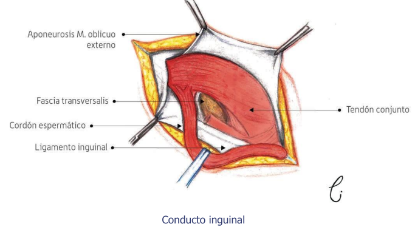

# Run it

Para correr el programa cargamos los archivos dentro de clips
- (load ../KBS-clips_handson/clips/surgeon/templates.clp)
- (load ../KBS-clips_handson/clips/surgeon/facts.clp)
- (load ../KBS-clips_handson/clips/surgeon/rules.clp)
- (reset)
- (run) 
- (: enjoy 

# Surgeon - Agent KBS

Para comenzar a trabajar con ello debemos definir 
nuestro resultado esperado y la problematica a enfrentar
queremos una lista de pasos y acciones a seguir obtenidas
del procesamiento de la información sobre una intervención
quirúrgica específica, para ello debemos conocer un poco acerca
de los pasos que se deben llevar a cabo y comenzar el modelado
de las reglas y facts que darán como resultado la lista de
pasos dependiendo la intervención.

## Building KBS

Mi primer acercamiento al problema fue intentar definir las plantillas,éstas deben corresponder a los
agentes que intervienen en las funciones a modelar,
se hace mayor enfasis en los agentes dinámicos que en los
estáticos, aunque el acceso o interacción con un agente estático
puede estar mediado por la acción de un agente dinámico, un cirujano impide
que la otro tenga el instrumento o material médico porque lo está utilizando.

Los principales agentes(a mi observar) en la intervención son:

- Cirujano principal
- Cirujano auxiliar
- Anestesista
- Enfermera circulante
- Enfermero instrumentista

El instrumental medico puede ser:
			(usos)
	Básico o Especializado

hecho de(composicion):
- Acero inoxidable
- Titanio
- Vitalio
- Otros metales

con (forma) distinta:

 - De un solo cuerpo
 - Articulados
 - Con cierre
 - Con forceps
 - De fibra
 
y su (función) puede ser de:

 - Diéresis o corte.
 - Separación
 - Aprehensión 
 - Síntesis
 - Drenaje 

con esa información se modelaron los templates y facts básicos.

Ahora pasaremos con las acciones básicas y la primer intervención a modelar

Después de haber analizado un poco los manuales que aparecen en las referencias pdf, comencé a adivinar de que hablaban con las técnicas,materiales,la forma en que cierto lenguaje conectaba partes del cuerpo o acciones.

decidí buscar información en internet para completar al menos un par de intervenciones y ejemplos para comenzar a provar el pattern matcher y generar un mvp.

En el manual de la Universidad de los Andes aparecen diversas intervenciónes quirúrgicás con sus respectivas sintomatologías y pruebas pre-operatorias sugeridas para su diagnóstico y descripciones acompañadas de imagenes para ilustrar los distintos abordajes de las intervenciones quirurgicas.

Los siguientes estados corresponden al paciente:

1. Estable (operable , intervención óptima)
2. Malito (inestable, operación en capacidad de posponerse)
3. Crítico (muy inestable, alta probabilidad de intervención)
4. Mortal (operable , invervención situacional)

La siguiente lista representa los estados(values) posibles del campo (estado-actual) de la intervención:

1. genesis (se asigna manualmente un ID de intervención y se relaciona una Cirugía, paciente y un equipo de personas para crear la intervención o el ambiente de interacción)
2. anestesia
3. posicionar
4. abordaje
5. incisiones
6. proceso?
7. sutura

Para poder definir el aboordaje de forma correcta se crearan asociaciones a los abordajes posibles para una operación con las situaciones donde se debería usar. (y una descripcion>?)

## Top 9 cirugías en México

### 1.- Reducción abierta de fractura con fijación interna, fémur.
- Esta clase de intervención se da en accidentes fuertes relacionados a las extremidades
inferiores, se les pone un sopore en su piernita, o recostados(boca arriba o abajo) se tiene acceso a la zona a intervenir, el abordaje dependerá del médico pero los más comunes son.

El abordaje(técnica a utilizar) debe considerar la patología, la técnica quirúrgica, la exposición y comodidad del cirujano.

1. Lobenhoffer
2. Anterolateral
3. Anterior directa
	- se diferencían por el tipo y forma de las incisiones

- en este caso espeficio(Reduccion abierta...)Los autores desaconsejan la vía de abordaje anterior directa
con osteotomía de la tuberosidad anterior de la tibia,
porque esta vía de abordaje se asocia a una tasa alta de
seudoartrosis.

#### Después : 
- preparar al paciente y personal 
- posicionarlo
- anestesiarlo 
- asegurarse del estado optimo del equipo de trabajo y compañeros
- procede a intervenir.

1. Se usa un bisturí y cuchillas específicas
2. incisión de pi a pa
	- otros cortesitos
3. Acomodamos el hueso
4. Fijamos, por ser femur con puede involucrar tornillos, placas, varillas, alambres o clavos especiales y cinta scotch
5. suturas

6. ?post-ops

## 2.- Reparación de hernía inguinal clásica

Comienza en la página 403 definiendo los componentes de la hernia

esta imagen de la página 408 generó la siguiente nota: 

	con esto me doy una idea de las 4 pinzas utilizadas para acceder y manipular los ligamentos y tendones involucrados en la cirugía

### En la página 411 se describen al menos 5 tipos de Hernioplastía y en la siguiente página las complicaciones de la cirugía

1. Herniorrafías inguinales clásicas por vía anterior (sin
uso de prótesis).
	- Operación de Bassini: Eduardo Bassini (1884-1929) sentó
las bases de la cirugía herniaria moderna por medio de
la reparación de la pared posterior del conducto inguinal.
Consiste en la sutura del arco del transverso y el tendón
conjunto al ligamento inguinal. Presenta una tasa de
recidiva alta (promedio a 5 años de un 5 a10%), debido
a la tensión generada en los tejidos.

	- Operación de McVay o reparación del ligamento de
Cooper: utilizada primero por Lotheissen (Austria, 1897),
pero popularizada por Chester McVay (1924). Une la
aponeurosis del músculo transverso al ligamento de
Cooper y al ligamento inguinal. Produce una gran tensión,
por lo que incluye una incisión de relajación en la vaina
del recto anterior.
	- Operación de Shouldice: desarrollada por el Dr.
Shouldice en 1950 en Toronto, Canadá. Se abre la fascia
transversalis y repara la pared posterior del conducto
inguinal con 4 planos de suturas continuas imbricando
los planos profundos y superficiales que incluyen la
fascia transversalis y los planos aponeuróticos. La Clínica
Shouldice reporta una baja tasa de recidiva con esta
técnica (1 a 2%).

2. Herniorrafía inguinal clásica por vía posterior (sin
uso de prótesis).
	- Operación de Nyhus: Lloyd Nyhus (1959) publicó su
técnica basada en el acceso a la región inguinal por vía
preperitoneal. Por esta vía se pueden tratar tanto hernias
inguinales como crurales.

3. Hernioplastía inguinal por vía anterior con uso de protesis

	- Técnica de Lichtenstein: se utiliza una malla protésica
que se sutura al ligamento inguinal y al tendón conjunto;
cortando la malla en un borde lateral para permitir el paso
del cordón inguinal y creando un nuevo anillo inguinal
profundo. Sus ventajas son el menor dolor posoperatorio
y baja recidiva (promedio menor al 2%).
	- Técnica de Gilbert: Arthur Gilbert en 1992 inventó un
dispositivo de dos mallas unidas por un cilindro (Prolene
Hernia System), donde uno de los extremos se introduce
por el anillo inguinal profundo y el otro extremo cubre
el conducto, lo que permite una reparación en 2 planos
(preperitoneal y anterior). No requiere suturas, se fija
gracias a la presión intraabdominal. Se reporta un bajo
índice de recidiva (menor a 2%7), pero tiene mayor costo.
	- Técnica de Rutkow-Robbins: introduce un tapón cónico
de malla en el anillo inguinal profundo que se sutura o
no a los tejidos vecinos.

4. Hernioplastía inguinal por vía posterior con uso de
prótesis

	- Técnica de Stoppa-Rives: En 1969, Stoppa describió
una reparación usando una malla protésica de gran
tamaño colocada en el espacio preperitoneal. Denominó
su técnica “reforzamiento protésico gigante del saco
visceral”. Indicada en grandes hernias (inguinoescrotales),
en hernias bilaterales y en recidivadas. No precisa suturar
la prótesis, que se mantiene en posición gracias a la
presión intraabdominal.

5. Hernioplastía inguinal laparoscópica
	- Por vía laparoscópica se accede al espacio preperitoneal
de la región inguinal, colocando una malla que refuerza la
pared posterior del conducto inguinal. Permite la visualización
y reparación simultánea de defectos herniarios bilaterales,
tanto inguinales como crurales, por el mismo acceso. En la
actualidad se utilizan 2 tipos de técnica laparoscópica:

-
-----
-----

# algunas páginas coinciden (tienen la misma informacion) sobre las cirugias más comnunes en méxico

1. Reducción abierta de fractura con fijación interna, fémur.
2. Laparotomía exploradora.
3. Salpingooforectomía unilateral.
4. Herniorrafía umbilical abierta.
5. Reparación unilateral de hernia inguinal.
6. Apendicectomía.
7. Extirpación local o destrucción de lesión o tejido de piel y tejido subcutáneo.
8. Sustitución de derivación ventricular.
9. Reducción abierta de fractura con fijación interna, húmero.
- (contenía "incisiones" como su propio apartado pero lo descarté )

## Rutinas Pre-operatorias(TODO?)

Descartar diversos padecimientos antes de cualquier operación:

0. Dar una respuesta distinta para cada cirugía pero siguiendo una base 
compartida, que son rutinarias independiente a la cirugía que se 
realiza y generalizar, acciones de las que solo dependa el IMC
o sexo de la persona a intervenir y no el paadecimiento directamente.

1. un proveedor de atención médica tomará su historia clínica y realizará un examen físico. Necesitará imágenes de su fémur, probablemente con una radiografía o tomografía computarizada (TC)., Coméntele a su proveedor de atención médica sobre todos los medicamentos que toma, incluidos los medicamentos de venta libre como la aspirina. Además, hágale saber la última vez que comió

- Las enfermedades concomitantes.
- Alergia a anestésicos locales.
- Alteraciones de la coagulación.
- Antecedentes de cicatrización queloide o hipertrófica.
- Trastornos circulatorios, inmunodeficiencias, hepatitis aguda o
crónica.
- Información sobre el procedimiento quirúrgico.
- Obtener el consentimiento del paciente.

## Manual de Cirugia

En el manual de cirugía uno de los primeros apartados habla sobre la homeostasis del paciente
la estabilización de las perdidas de distintos fluidos es algo que despreciaremos en el modelo puesto que no evaluaremos dinamicamente las cosas(TODO<<yet?>>).

cosas(estables/inestables/criticas);

p.p. - # 23
Mediante la Evaluación Subjetiva del Estado
Nutricional el paciente puede ser clasificado en:
1. Obeso.
2. Bien nutrido.
3. Riesgo de desnutrición.
4. Desnutrido.

	Aqui divide los intestinos operantes de los que no y con cuantos dias esta in/operatividad( <> 7 dias)

# Referencias 
1. [1] [Manual de Cirugía(Universidad de los Andes - 2016) : Joaquín,Krystel,Felipe,Rolando](../../Manual-de-Cirugia-UANDES.pdf)
2. [2] Manual Práctico de cirugía menor - Grupo de Cirugía menor y dermatológica
3. [3] [Introducción a la cirugía general (Ediciones MAWIL - 2020)](https://doi.org/10.26820/978-9942-826-33-6)

#### A).- [Reducción abierta con fijación interna para la fractura del fémur]
4. Reducción abierta con fijación interna para la fractura del fémur
https://carefirst.staywellsolutionsonline.com/spanish/TestsProcedures/135,334es

5. Reducción abierta y fijación interna de la fractura de fémur
https://goodmood-photobooth.com/es/reduccion-abierta-y-fijacion-interna-de-la-fractura-de-femur/

6. ¿Qué es la reducción abierta y fijación interna (RAFI) en la fractura de fémur?
https://myhealth.ucsd.edu/Spanish/RelatedItems/3,90322es

7. Cirugía de reducción abierta y fijación interna
https://www.cancercarewny.com/content.aspx?chunkiid=592618

8. Reducción abierta y fijación interna de las fracturas de la meseta tibial
https://campus.sanofi.es/dam/jcr:666e26f3-42b7-48d1-8aae-73628756ea8f/atlas_ch076.pdf

9. [La cirugía de reducción abierta y fijación interna (ORIF) Folleto informativo](https://intermountainhealthcare.org/ckr-ext/Dcmnt?ncid=521422285)

todo: formato de los links

esa respuesta ayuda muchisimo
https://stackoverflow.com/questions/24097473/modifying-the-current-fact-that-fires-a-rule